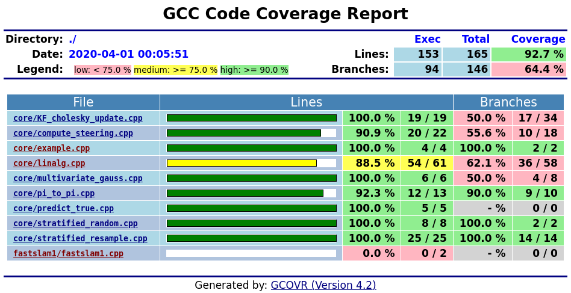

# FasterSLAM
> Fast Slam on steroids.

#### References
> Montemerlo, M., Thrun, S., Koller, D., & Wegbreit, B. (2002). FastSLAM: A factored solution to the simultaneous localization and mapping problem. Aaai/iaai, 593598.
[paper link](https://www.aaai.org/Papers/AAAI/2002/AAAI02-089.pdf)

> Thrun, S., Montemerlo, M., Koller, D., Wegbreit, B., Nieto, J., & Nebot, E. (2004). Fastslam: An efficient solution to the simultaneous localization and mapping problem with unknown data association. Journal of Machine Learning Research, 4(3), 380-407.
[paper link](http://robots.stanford.edu/papers/Thrun03g.pdf)


## Directory layout
Please consider this documented directory layout.
The structure is mostly preserved from the _yglee_ repository.
Note that the test directory has slightly changed.
More on tests below.
```
src
├── build/                          <-- run `cmake ..`, `make` and `ctest` here
├── CMakeLists.txt
├── core
│   ├── CMakeLists.txt              <-- add your source files here (no headers)
│   ├── example.cpp
│   ├── example.hpp
│   └── tests
│       ├── CMakeLists.txt
│       └── example_test.cpp        <-- testfiles ending in `_test.cpp` get registered automatically
├── external
│   ├── CMakeLists.txt
│   └── ut
│       └── ut.hpp
└── fastslam1
    ├── CMakeLists.txt              <-- add your source files here (no headers)
    ├── fastslam1.hpp               <-- header and source files with \
    ├── fastslam1.cpp               <-- the same name
    ├── main.cpp                    <-- main executable
    └── tests
        ├── CMakeLists.txt
        └── fastslam1_test.cpp      <-- testfiles ending in `_test.cpp`
```

## On testing
I have decided to use Kris Jusiak's lightweight testing framework [boost::ut](https://github.com/boost-experimental/ut) (Note that it is only a single header file and not part of the official boost library).
The library allows for a wide range of testing setups, including [Behaviour-Driven Development (BDD)](https://en.wikipedia.org/wiki/Behavior-driven_development) (see below for example) alongside "regular" tests.
I stronly encourage everyone to at least skim the excelent github page linked above.

The idea is that for every function/file `feature.hpp` we create a `feature_test.cpp` with a main and corresponding (Unit) Tests.
In there, we can use `boost::ut`'s testing functionality, as for example seen below in `example_test.cpp`.
Note that it is not neccessary to use the __BDD__ naming (_given_, _when_, _then_) but it makes for nicely structured tests.
```cpp
#include "example.hpp"  // import file to test

#include <vector>  // used for test input
#include "ut.hpp"  // import functionality and namespaces from single header file
using namespace boost::ut;  // provides `expect`, `""_test`, etc
using namespace boost::ut::bdd;  // provides `given`, `when`, `then`

int main() {
  "example test"_test = [] {
    expect(true) << "with more information!";
  };

  "vector add"_test = [] {
    given("I have two arrays") = [] {
      const size_t N = 5;
      double lhs[N] = {1,2,3,4,5};
      double rhs[N] = {1,2,3,4,5};

      when("I add them") = [&] {
        double res[N];
        add_two_arrays(&lhs[0], &rhs[0], &res[0], N);

        then("I get the elementwise sum") = [=] {
          "elementwise equal"_test = [res](size_t i) {
            expect(res[i-1] == 2*i);
          } | std::vector{1,2,3,4,5};
        };
      };
    };
  };
}
```

Note also that following the notion of [Test-Driven Development](https://en.wikipedia.org/wiki/Test-driven_development) and [Extreme Programming](https://en.wikipedia.org/wiki/Extreme_programming) we might even follow the notion of defining the tests for a feature even before implementing the feature itself.
This way, the requirements are quite clear and can be well tested while developing/chaning other code.


## On memory leak checking
CTest easily allows us to check our tests for memory leaks.
Make sure you have `valgrind` installed (e.g. check `> which valgrind`) and then
run
```sh
cd src; mkdir build; cd build
cmake .. -DCMAKE_BUILD_TYPE=Debug  # or -DTEST_COVERAGE=On
make
ctest . -T memcheck
```
Note that at the moment `core_example_test` produces a memory leak on purpose.


## On coverage
We use the tool [`gcov`](https://www.google.com/url?sa=t&rct=j&q=&esrc=s&source=web&cd=11&cad=rja&uact=8&ved=2ahUKEwig3szplsjoAhWB1aYKHZlVCZIQFjAKegQIBRAB&url=https%3A%2F%2Fgcc.gnu.org%2Fonlinedocs%2Fgcc%2FGcov.html&usg=AOvVaw2pGbCRoAgXY0dR57SJIuOH) (distributed with any installation of gcc) to provide information on [test/code coverage](https://en.wikipedia.org/wiki/Code_coverage).
We additionally use the python library [`gcovr`](https://github.com/gcovr/gcovr) to produce nicely formatted coverage output, similar to that of python test coverage tools (e.g. the [`nosetests`](https://nose.readthedocs.io/en/latest/plugins/cover.html) library).

### How to generate test coverage
First, you need to install the `gcovr` python library, i.e. `pip install gcovr`.
Afterwards you should have the `gcovr` binary in your path (check for example with `which gcovr`).
Then you need to set the CMake flag `TEST_COVERAGE=On`, build, and execute the cmake target `coverage`.
This not only prints to stdout but also produces nicely formatted output located at `<build_dir>/coverage/coverage.html`.
```bash
pip install gcovr  # if you haven't already

cd src; mkdir build; cd build
cmake .. -DTEST_COVERAGE=On  # Note this sets the build type to `Debug`

make  # compile the code
make test  # run the tests at least once (will generate gcov files during run)
make coverage  # use gcovr to parse and print coverage info

firefox ./coverage/coverage.html  # show detailed information
```

##### Example coverage output
```
------------------------------------------------------------------------------
                           GCC Code Coverage Report
Directory: /home/romeo/Documents/ETH/Advanced_Systems_Lab/FasterSlam/src
------------------------------------------------------------------------------
File                                       Lines    Exec  Cover   Missing
------------------------------------------------------------------------------
core/KF_cholesky_update.cpp                   19      19   100%   
core/compute_steering.cpp                     22      20    90%   36-37
core/example.cpp                               4       4   100%   
core/linalg.cpp                               61      54    88%   11-16,19
core/multivariate_gauss.cpp                    6       6   100%   
core/pi_to_pi.cpp                             13      12    92%   34
core/predict_true.cpp                          5       5   100%   
core/stratified_random.cpp                     8       8   100%   
core/stratified_resample.cpp                  25      25   100%   
fastslam1/fastslam1.cpp                        2       0     0%   1-2
------------------------------------------------------------------------------
TOTAL                                        165     153    92%
------------------------------------------------------------------------------
lines: 92.7% (153 out of 165)
branches: 64.4% (94 out of 146)
```

